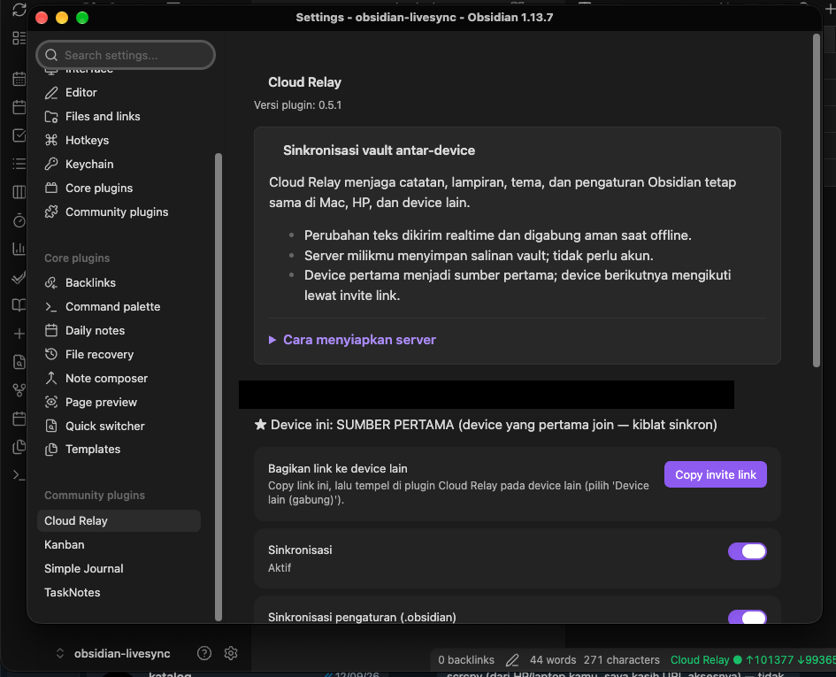

# Cloud Relay

Self-hosted, real-time vault synchronization for Obsidian. Mirrors notes, attachments, folders, and vault settings across your devices through your own server.

> [!NOTE]
> Cloud Relay requires a companion server, **DB Cloud Relay**, that you host yourself. No accounts, no third-party cloud.

## Features

- **Real-time sync** — edits propagate per-keystroke over WebSocket
- **Offline-safe** — edits made offline merge without conflicts; genuine same-section conflicts show a side-by-side picker (keep local, keep remote, or combine)
- **Full vault mirror** — notes, attachments (images/PDF), empty folders, themes, snippets, and selected `.obsidian` settings
- **Fast setup** — first device creates the vault, additional devices join with a single invite link
- **Recovery tools** — per-device "Restore from server" and server-side "Reset vault"

## Screenshots



*Setup and status panel. When two devices edit the same section offline, a picker offers: keep this device's version, keep the other device's version, or combine both.*

## Getting started

### 1. Run the server (once, on any Linux box)

```bash
git clone https://github.com/enl69/db-cloud-relay.git
cd db-cloud-relay
docker compose up -d
```

Then point a tunnel (e.g. Cloudflare Tunnel) at `localhost:1111` and grab the `ADMIN_TOKEN` from the logs:

```bash
docker compose logs | grep ADMIN_TOKEN
```

### 2. First device (e.g. your Mac)

1. Install the plugin and open **Settings → Cloud Relay**
2. Choose **Device pertama** (first device)
3. Enter your **Server URL** and the **Admin token**
4. Click **Create vault** — status bar turns green

### 3. Additional devices

1. On the first device: **Copy invite link**
2. On the new device: choose **Device lain (gabung)**, paste the link
3. Review the server summary (note count, last update), then either:
   - **Ikuti device pertama (ganti total)** — wipe local and mirror 100% from the first device
   - **Gabungkan** — merge local notes into the sync

> [!IMPORTANT]
> Do not run Cloud Relay alongside another sync plugin (Obsidian Sync, Self-hosted LiveSync, iCloud) on the same vault.

## Installing the plugin

- **Beta (recommended for now):** install [BRAT](https://github.com/TfTHacker/obsidian42-brat), then *Add beta plugin* → `enl69/cloud-relay`
- **Manual:** download `main.js`, `manifest.json`, `styles.css` from the [latest release](https://github.com/enl69/cloud-relay/releases/latest) into `<vault>/.obsidian/plugins/cloud-relay/`

## Security notes

- All traffic should go over HTTPS (e.g. via Cloudflare Tunnel)
- No end-to-end encryption: your server operator (you) can read vault contents
- Each vault has an unguessable ID + token; the invite link is a capability — treat it like a key

## Development

See [DEVELOPMENT.md](DEVELOPMENT.md) for architecture, protocol, invariants, incident history, and the test suite (`npm test`, `npm run e2e`).

## License

[MIT](LICENSE)
